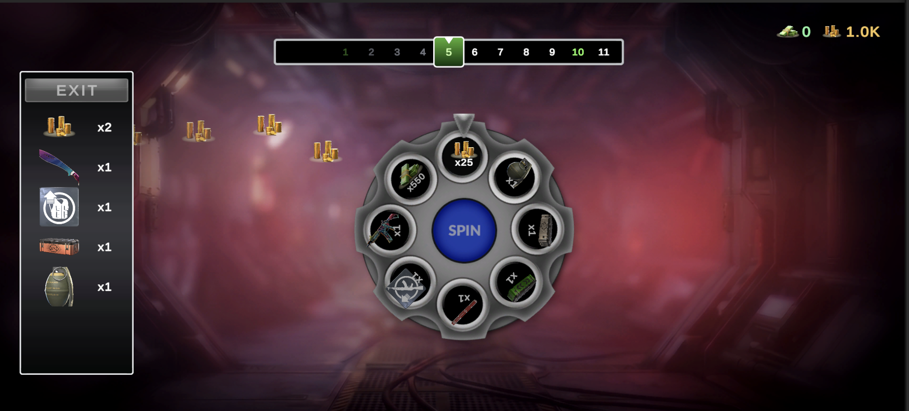
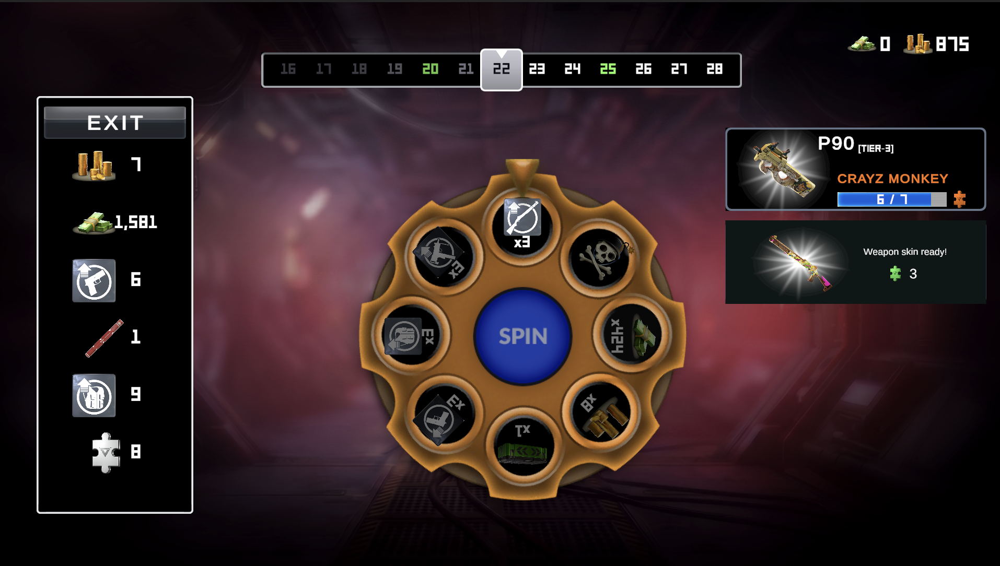
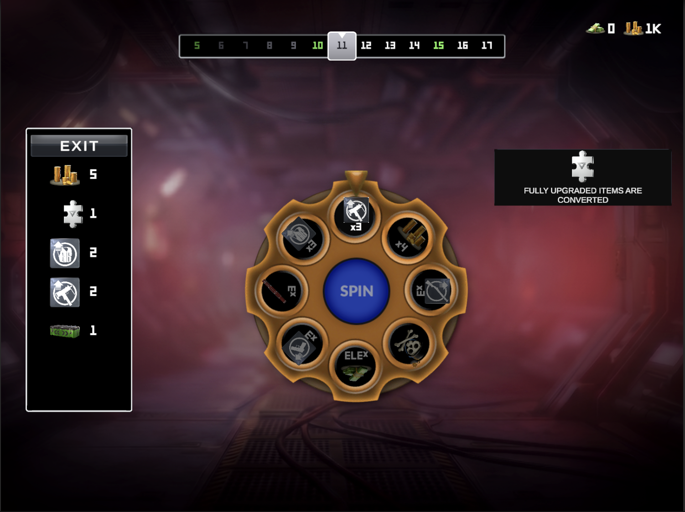

### 👾 Spin Wheel Card Reward Game 🫧

<i>Open cases, collect rewards, and test your luck.</i>

 

 

<b>How to play</b>

<table>
  <tr><th>Action</th><th>Effect</th></tr>
  <tr><td>Tap <b>SPIN</b></td><td>Spins the wheel and picks one of the 8 slots.</td></tr>
  <tr><td>Get a reward</td><td>Adds the reward to the current run.</td></tr>
  <tr><td>Complete a skin card</td><td>Finishes that skin card; extra points go to the general puzzle reward.</td></tr>
  <tr><td>Tap <b>EXIT</b></td><td>Saves the rewards collected in the current run.</td></tr>
  <tr><td>Hit death</td><td>The player either gives up the run or spends gold to continue.</td></tr>
  <tr><td>Give up / restart</td><td>Clears current run rewards and rolls back unfinished skin progress.</td></tr>
  <tr><td>Zone rules</td><td>Every 5th zone is safe, every 30th zone is super.</td></tr>
</table>

<b>Technical notes</b>

<table>
  <tr><td><code>RunSession</code> handles the main run flow.</td></tr>
  <tr><td>Wheel rewards are picked by category quotas, with icon and <code>visualFamily</code> checks to avoid repetitive-looking slots.</td></tr>
  <tr><td>UI panels react to run events instead of calling each other directly.</td></tr>
  <tr><td>Pooled UI objects are used for wheel slices, reward rows, and flying reward icons.</td></tr>
  <tr><td>PrimeTween is used for the wheel spin, reward fly/count animations, panel transitions, and meta-progress card feedback.</td></tr>
</table>

<b>Runtime flow</b>

<pre>
Spin
  |
ZoneTrack
  |
RunSession
  |-- WheelResultPicker -> 8 slots / quota / visualFamily
  |-- WheelController ----> spin finished callback
  |
ApplySpinResult
  |
  |-- death  -> RunDeathHitEvent -> RunExitController
  |                                -> WheelController cleanup
  |
  |-- reward -> RewardFeedbackController
                -> RewardAnimationSequence
                   -> RewardFlyIconPool
                   -> MetaProgressPanel
                   -> RewardListUI
                -> complete callback -> next zone
</pre>

<b>Run events</b>

<pre>
RunSession events
  |-- state changed  -> ZoneTrack, RunExitController
  |-- zone changed   -> ZoneTrack
  |-- currency       -> CurrencyHUD
  |-- pending clear  -> RewardListUI, MetaProgressPanel
  |-- exit overlay   -> RewardListUI, MetaProgressPanel
</pre>

<b>Screenshots</b>

  

  
   
  <code>20:9</code> &nbsp; Main gameplay

  
   
  <code>16:9</code> &nbsp; Skin progress and reward wheel

  
   
  <code>4:3</code> &nbsp; Completed items convert into puzzle progress

 

<b>Project setup</b>

<table>
  <tr>
    <td>Unity</td>
    <td><code>2021.3.45f2 LTS</code></td>
  </tr>
  <tr>
    <td>Scene</td>
    <td><code>Assets/Scenes/SampleScene.unity</code></td>
  </tr>
  <tr>
    <td>Packages</td>
    <td><code>PrimeTween</code> · <code>TextMeshPro</code> · <code>UGUI</code></td>
  </tr>
</table>

<b>License</b>

<table>
  <tr>
    <td>This project is proprietary. Unauthorized copying or use of this code is prohibited.</td>
  </tr>
</table>
