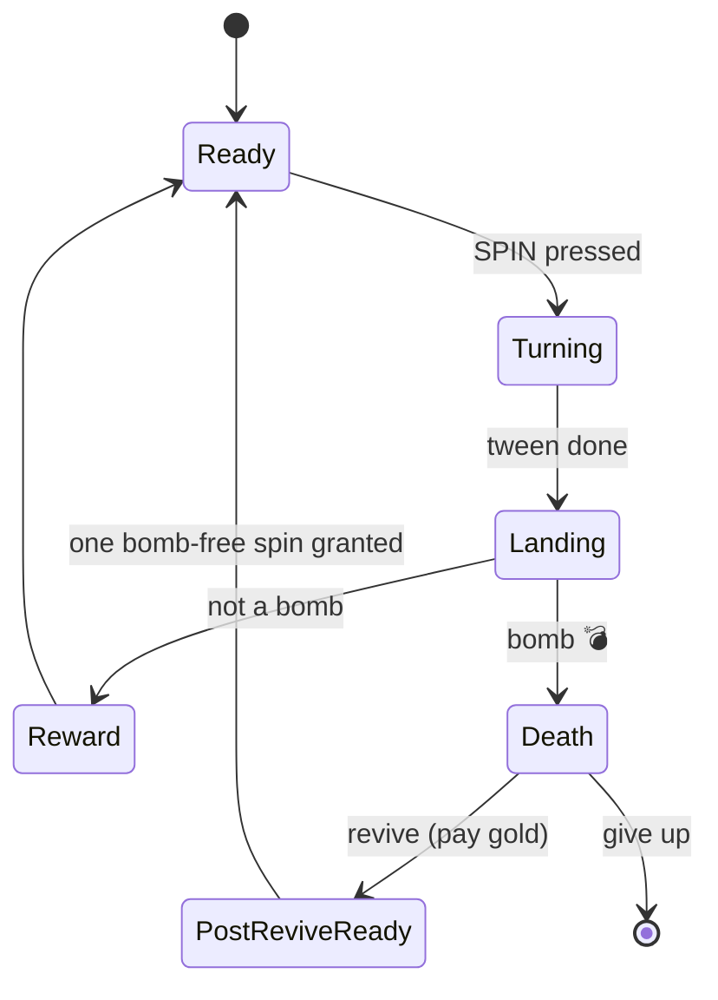

# 🎀 Vertigo Wheel of Fortune ✨

> A sweet little spin-the-wheel game where you collect rewards each spin and decide when to cash out — before a bomb crashes the party 💣


---

## 💖 The Vibe

Unity case study made for the **Vertigo Games** developer brief.
Tap to spin, collect rewards, dodge bombs, cash out at the perfect moment.

| | |
|---|---|
| 🎮 Engine | Unity **2021.3.45f2 LTS** |
| 📱 Target | Android · Landscape |
| 🎬 Scene | Single (`SampleScene.unity`) |
| 💌 Purpose | Vertigo Games developer case submission |

---

## 🌸 How to Play

| Action | What happens |
|---|---|
| 🎡 Tap **SPIN** | The wheel turns, a reward lands in your *pending* stash |
| 💰 Tap **EXIT** | Pending rewards move into your inventory forever ✨ |
| 🛡️ Every **5th** spin | **Safe** zone — no bombs, just breathe |
| 👑 Every **30th** spin | **Super** zone — the fancy stuff lives here |
| 💣 Normal zones | A bomb might land. If it does, the run ends |
| 🌷 Revive | Pay gold to keep your loot — each revive costs more |
| 💾 Persistence | Banked rewards survive between sessions (PlayerPrefs) |

---

## ✨ Highlights

The bits I'm a little proud of:

- 🧪 **Testable wheel logic** — `WheelLogic` is pure C#, no MonoBehaviour, runs without a scene
- 🎭 **Clean state machine** — `Ready → Turning → Landing → Reward → Death`, each state owns its own transitions
- 🍓 **ScriptableObject-driven content** — all wheel, zone & reward data lives under `Assets/Configs/`
- 🎀 **One-button rebuild** — `Vertigo → Build → Full Rebuild` reconstructs scene + UI from scratch
- 💫 **Reward sampler with quotas** — per-category limits + a small dedupe so the same icon never sits next to itself
- 🌺 **Object pooling** — reward icons & list rows, no GC hiccups during spins

---

## 🎨 Tech & Tools

- 🦋 **PrimeTween** for UI animations (panels, scale punches, wheel rotation)
- 💫 One custom particle effect for the reward-fly burst that lands on the side panel
- 📦 Sprite Atlas split into **6 categories** (Icon, Spin, Button, Panel, Frame, VFX)
- 💌 **TextMeshPro** on every label
- 📐 Canvas Scaler `ScaleWithScreenSize`, reference **1920×1080**, *Expand* mode
- 📲 **20:9 / 16:9 / 4:3** aspect ratios handled via Canvas Scaler Expand + center anchoring

---

## 🌷 Unity / UI Brief — Checklist

- ✅ Canvas Scaler `ScaleWithScreenSize`, reference 1920×1080, Expand mode
- ✅ 20:9 / 16:9 / 4:3 aspect ratios via Canvas Scaler Expand + center anchoring
- ✅ TextMeshPro on all labels — changeable labels use the `*_value` suffix (e.g. `reviveCost_value`)
- ✅ UI hierarchy follows `ui_image_*` / `ui_button_*` naming (general → specific)
- ✅ Decorative graphics have `raycastTarget` and `maskable` off — an editor pass enforces this across the scene
- ✅ ScriptableObjects under `Assets/Configs/` store all wheel, zone and reward content
- ✅ PrimeTween used for UI tweens
- ✅ Sprite Atlas split into 6 categories
- ✅ Whole UI can be rebuilt from `Vertigo → Build → Full Rebuild`

---

## 🌺 Architecture

### Spin state machine



States live in `Assets/Scripts/Wheel/Controller/` — `ReadyState`, `TurningState`, `LandingState`, `RewardState`, `DeathState`, `PostReviveReadyState`. They all derive from `WheelStateBase`. States never call each other directly; only `WheelController` performs transitions.

### What happens when you press SPIN

1. 🎀 Spin button → `WheelController.RequestSpin()`
2. 🎲 `WheelLogic.Spin(zone)` produces a `SpinResult` (which slice, how much, is it a bomb?)
3. 🌀 The wheel turns via `WheelView.SpinTo(...)` using PrimeTween
4. 🎁 On stop, the reward is added to `RewardInventory` as *pending* — or, if it's a bomb, we transition into the Death state
5. 💰 Tap **EXIT** and pending rewards move into the banked inventory

### Logic ↔ UI

`WheelLogic` is pure C# — no MonoBehaviour, runs without a scene. The UI side never touches it directly; it subscribes to `WheelController` events:
`OnZoneChanged`, `OnRewardEarned`, `OnDeathHit`, `OnRewardsBanked`, `OnRevived`, `OnRunEnded`.

### ExitFlow

`RunExitController` orchestrates the exit and death panels (`ExitFlowState`). In the EXIT flow, pending rewards move into the inventory. In the death flow, the revive button calls `WheelController.TryRevive()`. Revive cost grows each time: `reviveCurrencyCost * (1 + revive_count)`.

### MetaProgress

`MetaProgressionService` tracks weapon points earned during the run and reflects them on the MetaProgress panel. Resets when the run ends.

### Persistence

`PlayerProgress` stores cash, gold, and banked rewards in PlayerPrefs. Writes happen on bank, revive, app pause, and quit. Reads happen once on `Start`.

### Full Rebuild

`Vertigo → Build → Full Rebuild` does two things:
- `WheelDistributionApplier.Apply()` re-applies slice distributions to zones from config
- `WheelSceneSetup.Build()` rebuilds the scene's Canvas, wheel, and UI hierarchy from scratch

Run it once after a fresh checkout and you're good to go ✨

---

## 🍓 Project Structure

```
Assets/
  Scripts/
    Core/                  — ObjectPool, GameRules, formatters
    Wheel/
      Controller/          — WheelController + state machine
      Logic/               — WheelLogic + reward sampler (no MonoBehaviour)
      View/                — WheelView, SliceView, spin animator
      Config/              — ScriptableObject configs
      Rewards/             — RewardInventory, currency, formatter
      UI/                  — HUD, popups, reward list, MetaProgress
      ExitFlow/            — RunExitController, exit pill, revive
      MetaProgress/        — per-run weapon point progression
      Persistence/         — PlayerProgress (PlayerPrefs)
  Editor/
    Builders/              — scene + UI builders, validation audits
    Layout/                — UILayoutBuilder + layout passes
    Drawers/               — custom inspectors
  Configs/                 — SO assets (Zones, Rewards, MetaProgress, ...)
  Atlases/                 — Sprite Atlas files
  Scenes/SampleScene.unity — entry scene
```

---

## 🌼 How to Run

1. Open the project in **Unity 2021.3.45f2 LTS**
2. Run `Vertigo → Build → Full Rebuild` once after a fresh checkout
3. Open `Assets/Scenes/SampleScene.unity` and press **Play** ▶️

---

## 🎀 Build / Release

### Android APK
- `Tools → Build → Android APK` or `Tools → Build → Android APK + Run`
- Bundle id: `com.simay.vertigowheel`
- AndroidMinSdkVersion: 22
- Output: `Build/VertigoWheel.apk`

### GitHub Release
The APK is shared via a GitHub Release rather than committed to the repo.

### 📲 APK Download
[**Download APK ✨**](https://drive.google.com/file/d/1VxuD5v-L_xG7tuDoB4XAF-BY3kkhfsjW/view?usp=sharing)

---

## 📸 Screenshots

Screenshots live under `Docs/Screenshots/`.

| Aspect | Screenshot | Video |
|---|---|---|

| **16:9** |  | _TODO_ |
| **4:3**  | _TODO (`Docs/Screenshots/aspect_4-3.png`)_ | _TODO_ |

---

## 💎 Engineering Decisions

The interesting trade-offs, and *why*:

### 🌷 Revive uses a one-shot logic flag, not a pool-level slot skip
After paying gold to revive, the next spin gets one bomb-free guarantee via `forceNoBombNextSpin` on `WheelLogic`. If RNG lands on the bomb slot, we redirect to a neighbouring slice. The bomb slice is still visually on the wheel for that one spin.
**Why:** a pool-level skip would have meant rebuilding the slice list mid-flow. The logic-level guard was the smaller, safer change. The flag clears itself after a single spin so subsequent zones behave normally.

### 🦋 PrimeTween instead of a custom tween system
The only custom animation code is the reward-fly burst — a small particle effect.
**Why:** wheel cases aren't the place to reinvent a tween library.

### 🍓 MetaProgress rows aren't pooled
They're built once when the panel opens.
**Why:** there are only a handful of them; pooling would add complexity without a real win.

### 📲 No SafeArea handling
**Why:** the brief targets landscape only, and Canvas Scaler Expand covers the listed aspect ratios.

### 💾 PlayerPrefs for persistence
**Why:** enough for what the brief asks. A proper save file would be future work.

### ⏰ A small note on timing
I submitted slightly later than planned because I refactored the UI from a mostly code-driven setup into a more standard prefab-based structure late in development. The current shape is much closer to how production UI is usually authored, and I think the result justifies the slip.

---

## 💌 Credits

- **Developer:** Simay

---

<p align="center">made with 🎀 and a lot of spin retries</p>
